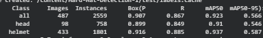
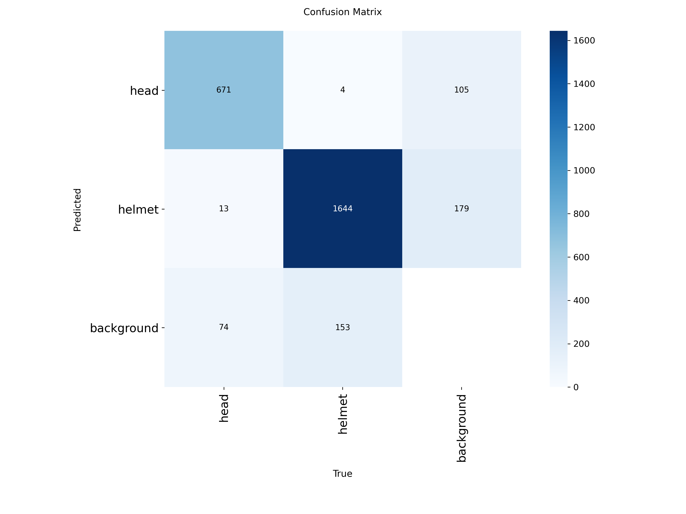
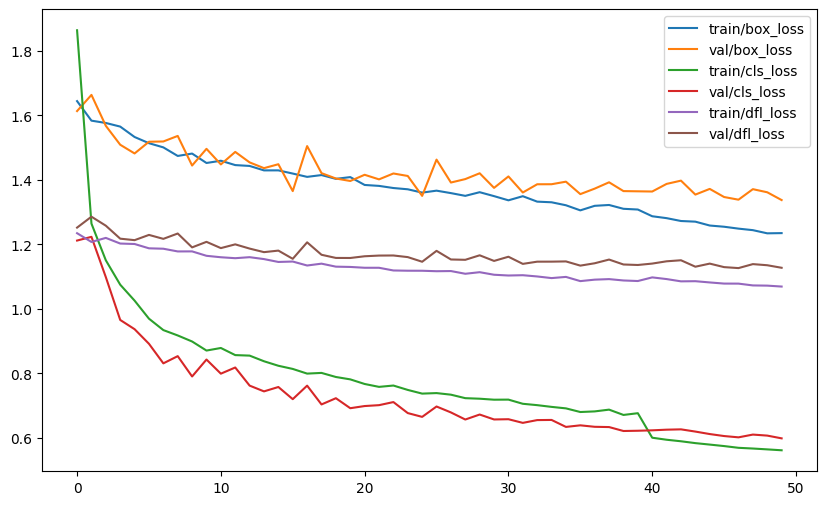

# 🪖 Helmet Detection for Construction Safety

> **An object detection system for automatically monitoring helmet compliance in construction sites using YOLO.**

## 🎯 Why This Project?

Ensuring helmet compliance on construction sites can be challenging when monitoring relies entirely on manual supervision.

This project explores how **computer vision and object detection** can be used to automatically identify whether workers are wearing safety helmets.

The model detects two categories:

| Class         | Description                    |
| ------------- | ------------------------------ |
| 🪖 **Helmet** | Worker wearing a safety helmet |
| 👤 **Head**   | Worker without a safety helmet |

---

## 🔍 Approach

Rather than only comparing different YOLO architectures, we investigated how **dataset refinement and class composition** influence detection performance.

### Models

* **YOLOv11n** — Baseline
* **YOLOv11n** — Refined dataset
* **YOLOv8m** — Refined dataset
* **YOLOv12n** — Refined dataset

### Workflow

```text
Construction Images
        ↓
Dataset Exploration
        ↓
Class Imbalance Analysis
        ↓
Dataset Refinement
        ↓
YOLO Model Training
        ↓
Model Evaluation
        ↓
Performance Comparison
```

---

## 📈 Key Findings

The initial dataset contained a significant class imbalance, particularly involving the **person** class.

After refining the dataset and removing the person class, the model showed a substantial improvement:

| Metric | Baseline |   Refined | Improvement |
| ------ | -------: | --------: | ----------: |
| Recall |    58.1% | **86.7%** |    +28.6 pp |
| mAP@50 |    62.9% | **92.3%** |    +29.4 pp |

### Final YOLOv11n Performance

* **Precision:** 90.7%
* **Recall:** 86.7%
* **mAP@50:** 92.3%
* **mAP@50-95:** 56.6%

### Main Insight

> **Dataset quality and problem formulation had a larger impact on performance than simply switching to a newer YOLO architecture.**

This highlights the importance of understanding the dataset before focusing on model complexity.

---

## 🖼️ Results

### Evaluation Metrics



### Confusion Matrix



### Training & Validation Loss



---

## 🧠 What I Learned

Through this project, I learned that improving a machine learning model is not always about choosing a more advanced architecture.

The biggest improvement came from:

* Identifying **class imbalance**
* Understanding the actual detection objective
* Refining the dataset
* Comparing model performance systematically
* Evaluating models using multiple metrics rather than accuracy alone

This project strengthened my understanding of the relationship between **data quality, model design, and real-world computer vision performance**.

---

## 🛠️ Tech Stack

**Programming & Deep Learning**

* Python
* PyTorch
* Ultralytics YOLO

**Data & Development**

* Roboflow
* Google Colab
* GPU Training

---

## 🚀 Future Work

Potential improvements include:

* Improving detection of **small and partially occluded objects**
* Handling overlapping workers in crowded construction scenes
* Testing the model on **real-time CCTV footage**
* Evaluating deployment on **edge devices**
* Expanding the dataset across different construction environments

---

## 👥 Team

**Data Science Students — BINUS University**

* Luna Alexa
* Nysa Setiawan
* Indira Rubita Bianca
* **Nazhifa Kirana Mulya Nugraha**
* Franciska Olivia Putri Warae
* Angelyn Nathasya Br. Marpaung

---

### 📌 Project Focus

**Computer Vision · Object Detection · Deep Learning · YOLO · Construction Safety**
